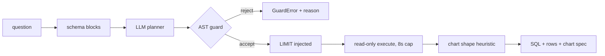

# insightengine — ask a warehouse a question in English, get guardrailed SQL back

[](https://github.com/darrshangovender/insightengine/actions/workflows/tests.yml)
[](LICENSE)
[](https://python.org)
[](https://fastapi.tiangolo.com)

> A natural-language analytics layer over a SQL warehouse. An LLM planner writes the query, a sqlglot AST guard proves it is a single read-only statement before anything executes, a read-only connection with a timeout runs it, and a shape heuristic picks the chart. The SQL comes back with the answer, every time.

## Scope

This is a **public reference implementation**. The production version at the Agulhas Code client (under NDA) runs against their multi-table Postgres warehouse with tenant isolation and their own schema documentation. The reference implementation here reproduces the same architecture — the same planner contract, the same AST guard, the same execution and charting path — against a seeded SQLite demo warehouse anyone can re-run. Accuracy and adoption figures from that engagement are not published.

**Why this exists.** Most SMEs sit on a warehouse only the engineer who built it can query. Stakeholders ask "what's our churn by tier last quarter?" and either wait days for a dashboard or accept a half-answer from a stale report. The hard part is not generating SQL — models are good at that. The hard part is being able to run generated SQL against production without lying awake.

---

## Quick start

```bash
make install
make seed        # build the demo SQLite warehouse (5 tables, ~670 rows, seed 42)
make eval        # 15 golden questions, offline, no API key
make run         # uvicorn on :8000
```

```bash
curl -s localhost:8000/ask -H 'content-type: application/json' \
     -d '{"question": "Show monthly revenue for the past year"}'
```

The guard works standalone, which is the piece most people want:

```python
from api.guard.sql_guard import guard_sql, GuardError

print(guard_sql("SELECT country, COUNT(*) FROM customers GROUP BY country"))
# → 'SELECT ... LIMIT 1000'   (LIMIT injected)

guard_sql("WITH x AS (DELETE FROM users RETURNING id) SELECT * FROM x")
# → GuardError: forbidden statement type inside CTE
```

End to end:

```python
from pathlib import Path
from api.planner.llm_planner import LLMPlanner
from api.planner.schema_retriever import SchemaRetriever
from api.guard.sql_guard import guard_sql
from api.exec.runner import QueryRunner
from api.charts.picker import pick_chart

db = Path("demo/demo.db")
plan = LLMPlanner(retriever=SchemaRetriever(db)).plan("Show monthly revenue for the past year")
result = QueryRunner(db, timeout_seconds=8.0).run(guard_sql(plan.sql, dialect="sqlite"))
print(pick_chart(result.columns, result.rows).type, result.row_count, result.elapsed_ms)
```

## How it works



1. `POST /ask` validates the question length.
2. `SchemaRetriever` reads `sqlite_master` and `PRAGMA table_info`, annotates columns with descriptions, and renders `CREATE TABLE` blocks for the prompt.
3. `LLMPlanner` sends a system prompt, two few-shot examples, the schema, and the question to Claude or GPT, then strips fences from the reply.
4. `guard_sql` parses with sqlglot and enforces: one statement, a read-only root, no forbidden node type anywhere in the tree, and a LIMIT.
5. `QueryRunner` opens the database read-only, installs a timeout, executes, and fetches.
6. `pick_chart` selects a shape from the first row's column types.
7. The response carries the **executed SQL** alongside the rows, so any answer can be audited or pasted into a client.

## What the guard enforces

| Rule | Blocks |
|---|---|
| Must parse | Anything sqlglot can't read — a parse failure is a rejection, not a pass |
| Exactly one statement | Stacked queries (`SELECT 1; DROP TABLE users`) |
| Read-only root node | Root must be `Select`, `Union`, or a `With` wrapping either |
| Forbidden node walk | `Delete`, `Update`, `Insert`, `Drop`, `TruncateTable`, `Alter`, `Create`, `Merge`, `Grant`, `Revoke`, `Command` — **anywhere in the tree**, including inside CTEs and subqueries |
| LIMIT injection | Missing LIMIT gets the default (1000); an oversized one is capped |

Chart shapes: `kpi` for a single cell, `line` for a date-ish first column, `bar` for a categorical first column, `scatter` for two numerics, `table` as the fallback.

## Design decisions

| Decision | Why |
|---|---|
| **AST walk, not regex** | Catches creative phrasings — `WITH x AS (DELETE …)` inside a CTE — that string filters miss. A regex for "DROP" is security theatre. |
| **A parse failure is a rejection** | If the guard cannot understand the query, it has no basis for saying it is safe. Fail closed. |
| **The executed SQL is part of the response** | An analytics answer nobody can check is a rumour with a chart attached. |
| **Result-shape heuristic for charts, not a second LLM call** | Deterministic, free, instant, and correct for the five shapes that cover almost all business questions. |
| **Read-only connection *and* a guard** | Defence in depth: the guard is the control, the read-only handle is the thing that saves you when the guard has a bug. |

## Limitations

- **There is no schema retrieval.** `get_relevant_tables()` discards the question — the parameter is explicitly deleted as unused — and returns every table. There is no embedding code and no vector store in this repo. The "retrieved schema slice for a 200-table warehouse" this README used to claim is not implemented; on the five-table demo it doesn't matter, and on a real warehouse it is the first thing you would have to build.
- **SQLite, not PostgreSQL.** The read-only role and `statement_timeout` in the old architecture diagram are actually a `mode=ro` URI flag plus a Python progress handler polled every 1000 VM instructions — which cannot interrupt blocking I/O or a single long-running operation.
- **No authentication or authorization on `/ask`.** Anyone who can reach the port can run arbitrary SELECT over every table, and `GET /schema` dumps the full schema unauthenticated. There is no row-level, column-level, or tenant filtering.
- **The guard blocks writes but not cost.** LIMIT is enforced only on the outermost SELECT; inner subquery limits are untouched, and a `Union` root always gets the default limit while discarding a user LIMIT. Cross joins, correlated subqueries and full scans are all permitted. The cost estimator that would fix this lives in the sibling [sql-guardrails](https://github.com/darrshangovender/sql-guardrails).
- **The default eval does not test the LLM.** Without `--online` it uses each question's committed `reference_sql`, so `make eval` measures the guard and executor only. The `must_contain` grading is also skipped offline, and is a case-insensitive substring check rather than semantic correctness.
- **Per-request object construction, no pooling.** A fresh retriever, runner and planner are built on every call — a new SQLite connection per request and a full schema re-read per question.
- **`PRAGMA table_info({table})` is f-string interpolated.** The name is sourced from `sqlite_master` so the risk is low, but it is unparameterised SQL construction inside the security-conscious path.
- **The published accuracy figures have been removed.** The previous version cited ~94% accuracy on 60 questions, 3–8s median latency, zero destructive incidents, and a 70% analyst-ticket reduction. The eval set contains 15 questions, no results artifact is committed, and none of the operational figures are traceable to anything in this repo.

## Project layout

```
insightengine/
├── api/
│   ├── main.py            # FastAPI: /health, /schema, /ask
│   ├── planner/           # schema_retriever · llm_planner (Anthropic / OpenAI)
│   ├── guard/             # sqlglot AST allowlist + LIMIT injection
│   ├── exec/              # read-only runner with a statement timeout
│   └── charts/            # result-shape → chart spec
├── demo/                  # seed.py (Faker, seed 42) + committed demo.db
├── eval/                  # golden_questions.yml (15) + run_eval.py
├── tests/                 # 30 tests
└── Makefile               # install · seed · run · eval · eval-online · test
```

## Tests

```bash
make test        # 30 tests
make eval        # 15 golden questions, offline
```

The guard suite is the substantial part: parametrised coverage of top-level write statements, writes hidden in CTEs and subqueries, multi-statement injection, and `CALL`/`EXEC`. CI runs it on every push.

## Author

Darrshan Govender · [Agulhas Code](https://agulhascode.co.za) · Durban, South Africa
